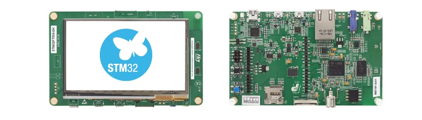

..
    Copyright 2020-2021 MicroEJ Corp. All rights reserved.
	This library is provided in source code for use, modification and test, subject to license terms.
	Any modification of the source code will break MicroEJ Corp. warranties on the whole library.

.. |BOARD_NAME| replace:: STM32F7508-DK
.. |PLATFORM_VER| replace:: 1.3.2
.. |RCP| replace:: MICROEJ SDK
.. |PLATFORM| replace:: MicroEJ Platform
.. |PLATFORMS| replace:: MicroEJ Platforms
.. |SIM| replace:: MicroEJ Simulator
.. |ARCH| replace:: MicroEJ Architecture
.. |CIDE| replace:: MICROEJ SDK
.. |RTOS| replace:: FreeRTOS RTOS
.. |MANUFACTURER| replace:: STMicroelectronics

.. _README MicroEJ BSP: ./stm32f7508_freertos-bsp/projects/microej/README.rst
.. _RELEASE NOTES: ./RELEASE_NOTES.rst
.. _CHANGELOG: ./CHANGELOG.rst

==========================================
|PLATFORM| for |MANUFACTURER| |BOARD_NAME|
==========================================

This project is used to build a |PLATFORM| for the |BOARD_NAME|
development board.

It is recommended to read this tutorial before using the platform: https://docs.microej.com/en/latest/Tutorials/tutorialUnderstandMicroEJFirmwareBuild.html

Related Files
=============

This directory also contains:

* `CHANGELOG`_ to track the changes in the MicroEJ
  |BOARD_NAME| Platform
* `RELEASE NOTES`_ to list:

  - the list of the dependencies and their versions.
  - the known issues and the limitations,
  - the development environment.

* `README MicroEJ BSP`_ recommended for users familiar with the
  |MANUFACTURER| SDK and advanced usage on how to customize the build
  process.

Board Technical Specifications
==============================

.. list-table::

   * - Name
     - |BOARD_NAME|
   * - MCU part number
     - STM32F750N8H6
   * - MCU architecture
     - Arm Cortex-M7
   * - MCU max clock frequency
     - 216 MHz
   * - Internal flash size
     - 64 KB
   * - Internal RAM size
     - 340 KB
   * - External flash size
     - 128 MB
   * - External RAM size
     - 64 MB 
   * - Power supply
     - ST-LINK USB  V\ :sub:`BUS`\  or external sources

Here is a list of |BOARD_NAME| useful documentation links:

- Board documentation available `here <https://www.st.com/en/evaluation-tools/stm32f7508-dk.html#documentation>`__
- MCU documentation available `here <https://www.st.com/en/microcontrollers-microprocessors/stm32f750n8.html#documentation>`__

Platform Specifications
=======================

The Architecture version is ``7.14.0``.

This Platform provides the following Foundation Libraries:

.. list-table::
   :header-rows: 1

   * - Foundation Library
     - Version
   * - BON
     - 1.4
   * - DEVICE
     - 1.0
   * - DRAWING
     - 1.0
   * - ECOM
     - 1.1
   * - ECOM-COMM
     - 1.1
   * - EDC
     - 1.3
   * - FS
     - 2.0
   * - HAL
     - 1.0
   * - KF
     - 1.5
   * - MICROUI
     - 3.0
   * - NET
     - 1.1
   * - NLS
     - 2.0
   * - SECURITY
     - 1.3
   * - SNI
     - 1.4
   * - SP
     - 2.0
   * - SSL
     - 2.2
   * - TRACE
     - 1.1
   * - WADAPPS
     - 1.0

The |PLATFORM| is derived into:

- a Mono-Sandbox Platform (default)
- a Multi-Sandbox Platform

The |PLATFORM| can be built using two toolchains:

- GCC
- IAR

Requirements
============

- PC with Windows 10
- Internet connection to `MicroEJ Central Repository <https://developer.microej.com/central-repository/>`_
- |RCP| Dist. ``20.12`` or higher, available `here <https://developer.microej.com/get-started/>`_
- |BOARD_NAME| board

BSP Setup
=========

Install at least one of the following C IDEs:

- The STM32CubeIDE version 1.3.0 for |BOARD_NAME|, available `here <https://www.st.com/en/development-tools/stm32cubeide.html>`__
- The IAR EmbeddedWorkbench version 8.50.5 for |BOARD_NAME|, available `here <https://www.iar.com/iar-embedded-workbench/>`__

STM32CubeIDE Setup
------------------

1. Install STM32CubeIDE.

IAR Embedded Workbench Setup
----------------------------

1. Install IAR Embedded Workbench.
2. Unzip the patch found here ``/stm32f7508_freertos-bsp/sdk/Utilities/PC_Software/patch/EWARM/``.
3. Execute the self-extracting archive ``EWARM_v7_ValueLine_STM32F7x0x8_Supportv4.0.exe``.
4. Apply the extracted patch to IAR Embedded Workbench installation directory (e.g. ``C:/Program Files (x86)/IAR Sys-tems/Embedded Workbench 8.4/``).

BSP Compilation
---------------

The Platform provides a pre-compiled Mono-Sandbox Application for each toolchain.
Validate the BSP installation by compiling the BSP to build a MicroEJ
Firmware.

To build the ``stm32f750-freertos-bsp`` project, open a
terminal:

- If you are using the GCC toolchain go to the directory ``xxx/stm32f750-freertos-bsp/projects/microej/SW4STM32``.
- If you are using the IAR toolchain go to the directory ``xxx/stm32f750-freertos-bsp/projects/microej/EWARM``.

Run the following commands:

**On Windows:**

.. code-block:: sh

      $ build.bat 

The BSP project build is launched. Please wait for the end of the build.

The build script expects the toolchain to be installed at a known
path.  If you installed it elsewhere, see `README MicroEJ BSP`_ for
how to customize its path.

Board Setup
===========

Please refer to the `README MicroEJ BSP`_ ``Board Configuration`` section
for more details.

Power Supply
------------

The board can be powered by a mini-USB cable.

Programming
-----------

The |BOARD_NAME| board can be flashed using |MANUFACTURER|
bootloader. Please Follow the steps below:

- Connect the USB connector of the board to your computer.
- Open a terminal.
- If you are using the GCC toolchain go to the directory ``xxx/stm32f750-freertos-bsp/projects/microej/SW4STM32``.
- If you are using the IAR toolchain go to the directory ``xxx/stm32f750-freertos-bsp/projects/microej/EWARM``.

**On Windows:**

.. code-block:: sh

      $ run.bat 

The firmware is launched.

|BOARD_NAME| build and flash documentation are also available in the `README MicroEJ BSP`_ for more details.

Logs Output
-----------

MicroEJ platform uses the virtual UART from the |BOARD_NAME|
USB port.  A COM port is automatically mounted when the board is
plugged to a computer using USB cable.  All board logs are available
through this COM port.

The COM port uses the following parameters:

.. list-table::
   :widths: 3 2

   * - Baudrate
     - 115200
   * - Data bits bits
     - 8
   * - Parity bits
     - None
   * - Stop bits
     - 1
   * - Flow control
     - None

If flashed, the pre-compiled application outputs ``Hello World`` on
the UART.

When running a Testsuite, logs must be redirected to a secondary UART
port.  Please refer to `Testsuite Configuration`_ for a detailed
explanation.

Debugging
---------

A JTAG interface is also directly available through the USB interface.

Please refer to the `README MicroEJ BSP`_ section debugging for more
details.

Platform Setup
==============

Platform Import
---------------

Import the projects in |RCP| Workspace:

- ``File`` > ``Import`` > ``Existing Projects into Workspace`` >
  ``Next``
- Point ``Select root directory`` to where the project was cloned.
- Click ``Finish``

Inside |RCP|, the selected example is imported as several projects
prefixed by the given name:

- ``stm32f7508_freertos-configuration``: Contains the
  platform configuration description. Some modules are described in a
  specific sub-folder / with some optional configuration files
  (``.properties`` and / or ``.xml``).

- ``stm32f7508_freertos-bsp``: Contains a ready-to-use BSP
  software project for the |BOARD_NAME| board, including a
  |CIDE| project, an implementation of MicroEJ core engine (and
  extensions) port on |RTOS| and the |BOARD_NAME| board
  support package.

- ``stm32f7508_freertos-fp``: Contains the board description
  and images for the |SIM|. This project is updated once the platform
  is built.

- ``STM32F7508-Platform-CM7hardfp_GCC48-{version}``:
  Contains the |RCP| Platform project for the GCC toolchain which is empty by default until
  the Platform is built. This platform project will be the one built by default. To build using
  IAR toolchain instead, please see the note below.

- ``STM32F7508-Platform-CM7hardfp_IAR83-{version}``:
  Contains the |RCP| Platform project for the IAR toolchain which is empty by default until
  the Platform is built. This platform project will not be the one used by default. To build using
  IAR toolchain instead, please see the note below.

By default, the Platform is configured as a Mono-Sandbox Evaluation
Platform. To build the platform you need a MicroEJ license, if you don't have one, follow the procedure described 
`here <https://docs.microej.com/en/latest/overview/licenses.html>`__.

.. note::

  The default toolchain is GCC.
  If you want to switch to the IAR toolchain, open ``stm32f7508_freertos-configuration/module.properties``
  and follow its documentation to set the ``xpf.name`` and ``xpf.toolchain.name`` properties.

.. note::

  To build a Multi-Sandbox platform, open ``stm32f7508_freertos-configuration/STM32F7508.platform``,
  go to the ``Content`` tab and check ``Multi Applications``.

Platform Build
--------------

To build the Platform, please follow the steps below:

- Right-click on ``stm32f7508_freertos-configuration``
  project in your |RCP| workspace.
- Click on ``Build Module``

The build starts.  This step may take several minutes.  The first
time, the Platform build requires to download modules that are
available on the MicroEJ Central Repository.  You can see the progress
of the build steps in the MicroEJ console.

Please wait for the final message:

.. code-block::

                          BUILD SUCCESSFUL

At the end of the execution the |PLATFORM| is fully built for the
|BOARD_NAME| board and is ready to be linked into the |CIDE|
project.

The Platform project should be refreshed with no error in the |RCP|
``STM32F7508-Platform-CM7hardfp_GCC48-{version}``, or ``STM32F7508-Platform-CM7hardfp_IAR83-{version}``
if you changed the toolchain for IAR.

Please refer to
https://docs.microej.com/en/latest/ApplicationDeveloperGuide/standaloneApplication.html
for more information on how to build a MicroEJ Standalone Application.

Testsuite Configuration
=======================

To run a Testsuite on the |BOARD_NAME| board please refer to the testsuite tutorial `here <https://docs.microej.com/en/latest/Tutorials/tutorialRunATestSuiteOnDevice.html>`__ 

In ``config.properties``, the property ``target.platform.dir`` must be
set to the absolute path to the platform.  For example
``C:/Platform-STMicroelectronics-STM32F7508-DK/STM32F7508-Platform-CM7hardfp_GCC48-{version}/source``.

Troubleshooting
===============

Files not found during the build
--------------------------------

Errors about files not found during the build may be caused by long
path.  Please refer to the known issues and limitations in the
`RELEASE NOTES`_ for a workaround.
