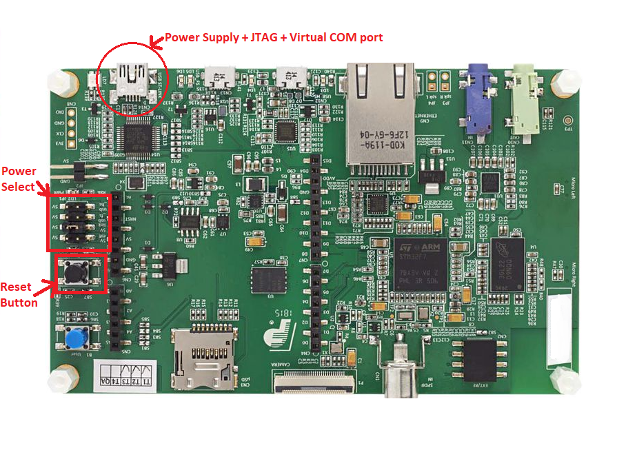

.. 
	Copyright 2021-2023 MicroEJ Corp. All rights reserved.
	Use of this source code is governed by a BSD-style license that can be found with this software.

.. |BOARD_NAME| replace:: STM32F7508-DK
.. |VEEPORT_VER| replace:: 2.1.2
.. |RCP| replace:: MICROEJ SDK
.. |VEEPORT| replace:: VEE Port
.. |SIM| replace:: Simulator
.. |ARCH| replace:: MicroEJ Architecture
.. |CIDE| replace:: MICROEJ SDK
.. |RTOS| replace:: FreeRTOS RTOS
.. |MANUFACTURER| replace:: STMicroelectronics

.. _README: ./../../../README.rst
.. _RELEASE NOTES: ./../../../RELEASE_NOTES.rst
.. _CHANGELOG: ./../../../CHANGELOG.rst

================
|BOARD_NAME| BSP
================

This project contains the BSP sources of the |VEEPORT| for the
|BOARD_NAME|.

This document does not describe how to setup the |VEEPORT|.  Please
refer to the `README`_ for that.

Board Configuration
-------------------

STM32F7508-DK provides several connectors, each connector is used by the MicroEJ Core Engine itself or by a foundation library.

Mandatory Connectors
~~~~~~~~~~~~~~~~~~~~

STM32F7508-DK provides a multi function USB port used as:

- Power supply connector
- Probe connector
- Virtual COM port

Ensure the Power Supply jumper JP1 is fit to the second opetion: 5V link (default setting).
Then just plug a mini USB Type-B cable from a computer to power on the board, to be able to program an application on it and see the traces.

For a detailed Power Supply setup check the user manual on ST website under `Resources <https://www.st.com/resource/en/user_manual/dm00537062-discovery-kit-for-stm32f7-series-with-stm32f750n8-mcu-stmicroelectronics.pdf>`__ tab.

CPU clock
---------

- Although the MCU supports a maximum SYSCLK of 216MHz, the BSP configured the SYSCLK to 200MHz
- Configuring the SYSCLK to 216MHz is only possible with an FMC_SDCLK configured to 72MHz `datasheet <https://www.st.com/resource/en/datasheet/stm32f750n8.pdf>`__
- We gain performance for CPU, but decrease greatly for SDRAM so overall, 200MHZ for SYSCLK and 100MHz for FMC is the optimal config.

Build & Flash Scripts
---------------------

In the folder ``project/microej/scripts/SW4STM32`` for the GCC toolchain and ``project/microej/scripts/EWARM`` 
for the IAR toolchain are scripts that can be used to build and flash the BSP.

- The ``build.bat`` scripts are used to compile and link the BSP with a
  MicroEJ Application to produce a MicroEJ Firmware
  (``application.out``) that can be flashed on a device.

- The ``run.bat`` scripts are used to flash a MicroEJ Firmware
  (``application.out``) on a device.

These scripts work out of the box, assuming the toolchain is
installed in the default path.

The following environment variables are customizable:  

**GCC toolchain**

- ``ECLIPSE_CDT_INSTALLATION_DIR``: The path to Eclipse CDT installation directory  (already set to the STM32CubeIDE 1.9.0 default installation directory).
- ``CUBE_PROGRAMMER_DIR=``: The path to Cube Programmer installation directory (already set to the Cube Programmer default installation directory).
- ``ECLIPSE_CDT_WORKSPACE_DIR``: The path to the workspace directory in which the project will be imported. (already set to the ``xxx/stm32f7508_freertos-bsp/projects/microej/cdt_workspace`` directory).
- ``ECLIPSE_CDT_PROJECT_CONFIGURATION``: The project configuration (``Debug`` or ``Release``).
- ``ECLIPSE_CDT_EXECUTABLE``: The Eclipse CDT executable file (``stm32cubeidec.exe`` by default).
- ``ECLIPSE_CDT_PROJECT_DIR``: The directory that contains the ``.cproject`` CDT project file  (set to ``%~dp0``: the directory that contains the executed ``.bat``).
- ``ECLIPSE_CDT_PROJECT_NAME``: The Eclipse CDT project name (``application`` by default).

**IAR toolchain**

- ``IAREW_INSTALLATION_DIR``: The path to IAR installation directory (already set to the default IAR Workbench default installation directory).
- ``IAREW_PROJECT_CONFIGURATION``: The project configuration (``Debug`` or ``Release``).
- ``IAREW_PROJECT_DIR``: The directory that contains the ``application.eww`` IAR project file (set to ``%~dp0``: the directory that contains the executed ``.bat``).
- ``IAREW_PROJECT_NAME``: The Eclipse CDT project name (``application`` by default).

The environment variables can be defined globally by the user or in
the ``set_local_env.bat`` scripts.  When the ``.bat`` scripts
are executed, the ``set_local_env.bat`` script is executed if it exists.
Configure these files to customize the environment locally.

Debugging with the |BOARD_NAME|
-------------------------------

GCC Debugging
~~~~~~~~~~~~~

- Open the file ``stm32f7508_freertos-bsp/projects/microej/SW4STM32/set_project_env.bat``.
- Set the target configuration to ``Debug``.

.. code-block::

      SET ECLIPSE_CDT_PROJECT_CONFIGURATION=Debug

- Open the CDT project in STM32CubeIDE:

  - Go to ``File > Import... > General > Existing Projects into Workspace``
  - Check ``Select root directory`` and browse for the ``stm32f7508_freertos-bsp/projects/microej/SW4STM32`` directory
  - Select ``application`` project 
  - Ensure that ``Copy projects into workspace`` is not checked and click on Finish.
  - Ensure that the ``Debug`` Build configuration is selected
  - Right-click on the ``application`` project > ``Build configurations`` > ``Set Active`` > ``Debug``
- Build and link the firmware: Right-click on the ``application`` project > ``Build Project``
- Connect the |BOARD_NAME| to your computer
- Start the debug session: 

  - Click on ``Run`` > ``Run configurations``
  - Select ``application_debug`` configuration and click on ``Run``.

- To reduce build time, the `Generate list file` option is disabled in the Release launcher. To enable list file generation, Right-click on the ``application`` C/C++ Build > Settings > and check Generate list file

IAR Debugging 
~~~~~~~~~~~~~

- Open the file ``stm32f7508_freertos-bsp/projects/microej/EWARM/set_project_env.bat``.
- Set the target configuration to ``Debug``.

..  code-block::

      SET IAREW_PROJECT_CONFIGURATION=Debug

- Open the IAR project in IAR Workbench (open the file ``stm32f7508_freertos-bsp/projects/microej/EWARM/application.eww`` from IAR Workbench or by double-clicking on it from the MicroEJ SDK).
- Ensure that the ``Debug`` target is selected in the workspace tab
- Build and link the firmware: Right-click on the ``application`` project > ``Make`` or Press 'F7'
- Connect the |BOARD_NAME| to your computer
- Start the debug session by clicking on ``Project`` > ``Download and Debug``
